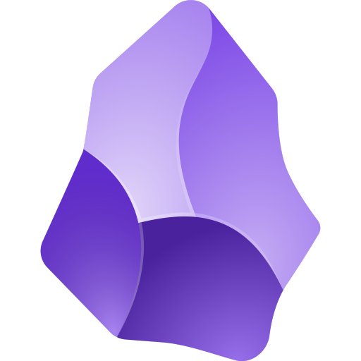
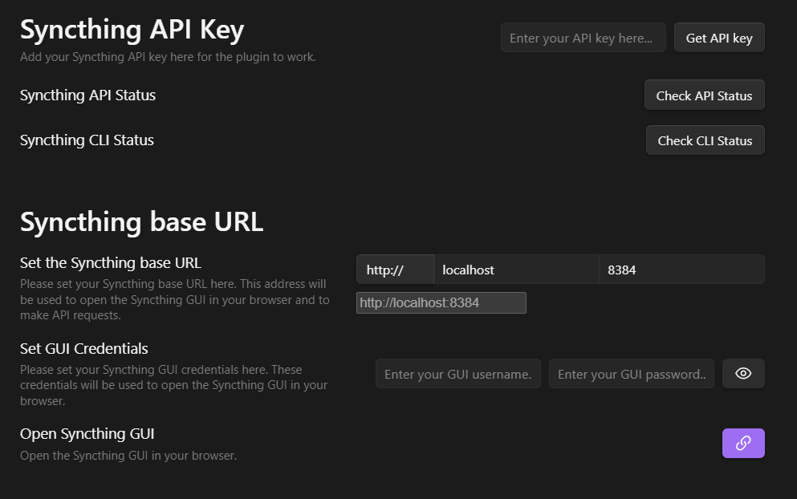

 
 <h1 align=center>Obsidian Syncthing integration</h1>

This plugin allows you to integrate tools in your Obsidian vault for managing synchronization using [Syncthing][syncthing website].

## :label: Badges

<!-- ignore markdownlint rule below -->
<!-- markdownlint-disable MD051 -->

[][discussions]

## :link: Useful links

### Related softwares

- [Syncthing][syncthing website]
- [Obsidian][obsidian website]

### Plugin's related links

- [Roadmap](docs/ROADMAP.md)
- [GH Discussions][discussions]

## :arrow_down: Installation

You can install the plugin using the following ways :

- From the community plugins tab within Obsidian
- From the [releases page](https://github.com/lbf38/obsidian-syncthing-integration/releases) on GitHub
- From the source code, please see [the Development section](#🛠️-development)
- With [Obsidian42 BRAT](https://github.com/TfTHacker/obsidian42-brat)

### Guides

The best way to install the plugin is via the Obsidian Community Plugins tab. You can find a guide on how to do this [here](https://help.obsidian.md/Extending+Obsidian/Community+plugins).

Otherwise, you can download the latest release from the [releases page](https://github.com/lbf38/obsidian-syncthing-integration/releases) on GitHub. Then, you can install the plugin manually by downloading the `main.js`, `manifest.json` and `styles.css` files and placing them in your vault's `.obsidian/plugins/obsidian-syncthing-integration` folder.

If you want to install the plugin from the source code, please see [the Development section](#🛠️-development).

Finally, you can install the plugin with [Obsidian42 BRAT](https://github.com/TfTHacker/obsidian42-brat) and provide the GitHub repository URL. Please see the [BRAT documentation](https://tfthacker.com/Obsidian+Plugins+by+TfTHacker/BRAT+-+Beta+Reviewer's+Auto-update+Tool/Quick+guide+for+using+BRAT)

## :eyes: Plugin Vision

> [!NOTE]
> The [initial vision](docs/initial_vision.md) of this plugin has evolved since its creation. As I have tested and tried to implement the plugin, I have realized that some features are not feasible or not necessary.
> Therefore, some expected features or behaviours might misdirect users. An updated description of the plugin's goals is described below.

This plugin now aims to provide integrated features related to [Syncthing][syncthing website] and [Obsidian][obsidian website]. You can see the [Roadmap](docs/ROADMAP.md) for more information about the plugin's features and future developments.

> [!NOTE]
> If you want a full integrated [Syncthing][syncthing website] synchronization with your notes app, you can try the [anytype notetaking app](https://anytype.io/). It provides a full integration of a syncing protocol in the note-taking app, [see more about this here](https://github.com/anyproto/any-sync).

This project provides features like [conflicting files resolution](./docs/features/conflict_files_resolutions.md), [status bar feature](./docs/features/status_bar.md), diff conflicting files, [ignoring files from synchronization](./docs/features/ignoring_files.md), and more.
See all plugin's features documentation in the [`docs/features` folder](./docs/features/).

It is mainly features based on files available in the vault and that are specific to [Syncthing][syncthing website].
Feel free to suggest new features or improvements in the [Discussions tab][discussions] or via [a new issue][issues].

Moreover, the integrated [Syncthing][syncthing website] configuration panel (`coming soon`) will provide a way to configure [Syncthing][syncthing website] directly from [Obsidian][obsidian website]. It will be a lighter version than the official [Syncthing][syncthing website] app, due to technical limitations.

The plugin is more focused on getting information from an active [Syncthing][syncthing website] instance on your device (PC, mobile or tablet) and provide you meaningful information about the status of the synchronization.

## :wrench: Configuration

> [!WARNING]
> Please backup your vault and use this plugin wisely. Some features could modify files in your vault so please always remember to backup your vault in a different location.

:construction: This plugin is still in development. The configuration might not yet be fully available. :construction:

The plugin's configuration provides a way to set up the connection to your [Syncthing][syncthing website] instance.
On Desktop, it should be straightforward if you have the CLI installed. Otherwise, you can use the GUI to set up the connection.

Click here to see an example of the configuration settings

> [!IMPORTANT]
> The synchronization is done in real-time, using peer-to-peer connections. Therefore, all the devices you want to synchronize must be connected at the same time.
>
> To overcome this, you could setup one device as a relay server. This device will be always connected and will relay the data between the other devices, like a NAS or a VPS.

## :memo: Documentation

You can browse the current plugin's documentation in the [`docs` folder](./docs/).

There, you'll find documentation about the plugin's roadmap, current features and other notes concerning the project.

Feel free to open [a new GH discussion][discussions] if you need some help.

## :heart: Contributing

To contribute to this plugin, you can create [issues] and [pull requests] on GitHub. Moreover, you can discuss any new idea or suggestion in the [Discussions tab][discussions].
Please follow the [Code of Conduct](.github/CODE_OF_CONDUCT.md) when contributing to this project and read the [Contributing guidelines](.github/CONTRIBUTION.md).

## :hammer_and_wrench: Development

If you want to develop this plugin locally, please follow the instructions below.

1. Clone the repository
2. Install the dependencies using `pnpm install`
3. Build the plugin using `pnpm dev`
4. (Optional) Use the [hot-reload plugin](https://github.com/pjeby/hot-reload) in Obsidian to reload the plugin automatically when you make changes

> [!NOTE]
> When using the hot-reload plugin, you have to clone this plugin in the `.obsidian/plugins` folder of your vault.
> And the plugin's files should be at the root of the folder. (`main.js`, `manifest.json` and `styles.css`)
> It should be automatically set up.

## :clap: Credits

Here are some inspirations for this plugin :

- [Obsidian version history diff by kometenstaub](https://github.com/kometenstaub/obsidian-version-history-diff) - credits for :
  - the [`styles.scss`](src/styles.scss) file,
  - corresponding [`esbuild` SCSS/CSS config](esbuild.config.mjs),
  - and an overall inspiration for the diff modal layout, when resolving file conflicts.
- [Obsidian testing vault by pedersen](https://github.com/pedersen/obsidian-testing-vault) - credits for :
  - the plugin's dev mode feature. I added a dev mode modal to easily generate testing files w/ syncthing conflicts format.

## :busts_in_silhouette: Authors

- [@LBF38](https://github.com/lbf38)

## :sparkles: Contributors

<!-- ALL-CONTRIBUTORS-LIST:START - Do not remove or modify this section -->
<!-- prettier-ignore-start -->
<!-- markdownlint-disable -->
<table>
  <tbody>
    <tr>
      <td align="center" valign="top" width="14.28%"><a href="https://github.com/LBF38"> <b>LBF38</b></a> <a href="https://github.com/LBF38/obsidian-syncthing-integration/commits?author=LBF38" title="Code">💻</a> <a href="https://github.com/LBF38/obsidian-syncthing-integration/commits?author=LBF38" title="Documentation">📖</a></td>
      <td align="center" valign="top" width="14.28%"><a href="https://github.com/jsamuel1"> <b>Josh Samuel</b></a> <a href="https://github.com/LBF38/obsidian-syncthing-integration/commits?author=jsamuel1" title="Code">💻</a></td>
    </tr>
  </tbody>
</table>

<!-- markdownlint-restore -->
<!-- prettier-ignore-end -->

<!-- ALL-CONTRIBUTORS-LIST:END -->

## :memo: Licensing

This project is licensed under the MIT License. See [`LICENSE`](LICENSE) for more information.

[issues]: https://github.com/lbf38/obsidian-syncthing-integration/issues/new/choose
[pull requests]: https://github.com/lbf38/obsidian-syncthing-integration/compare
[discussions]: https://github.com/lbf38/obsidian-syncthing-integration/discussions
[syncthing website]: https://syncthing.net/
[obsidian website]: https://obsidian.md/
